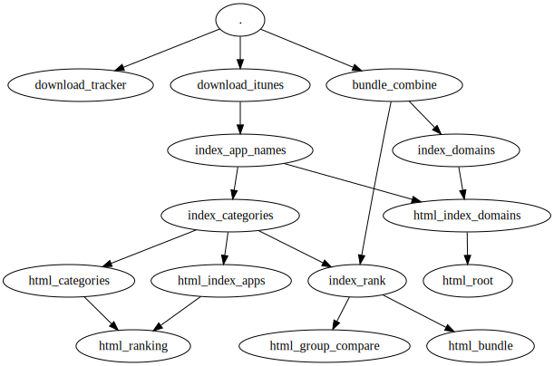

## Structure

In general all `html_` scripts generate the html output and all other scripts generate intermediate or commonly used `json` files.

### Adding new recordings
`api/v1/contribute/index.php` handles incomming recording contributions. They are automatically inserted in their appropriate folder e.g. `data/com/apple/notes`. Additionally the php places a marker (bundle-id) in `data/_in`.

### Updating data
A cron job runs every minute and checks `data/_in` for new markers. If there is a new one, rebuild the app html page and all json files that are affected.  
There are two special cases `_longterm` and `_manually`. In the latter case the user did not provide an appropriate app prior upload. They must be evaluated manually and completely ignored from automatic processing.  
The former is self explainatory. Recordings with over an hour recording time.

**Run:** `main.py import` which does everything and avoids unnecessary rebuilding.

### Updating tracker db
Ad- and tracking domains are not automatically updated. In fact not at all. You could create a cron job for that too. Like once a week or so.

**Run:** `main.py tracker` which will update the db and all app pages that are affected.

If you want to add custom domains, edit `api/v1/trackers/list.txt` and run the same command.

### Delete a single app
The delete command does not delete the app result (json), only the html files. So if you rebuild the website it will reappear. This function is here for the cases where you already delete the json files, but the html output is still online.

**Run:** `main.py del com.apple.notes com.apple.siri`

### Development & Complete rebuild
During development or if pushing new changes to the server, you'll need to rebuild all existing html files. You can do that by rebuilding all individual apps and the app + domain indices.

**Run:** `main.py run '*' && main.py index`

If you are missing some icons run `main.py icons`. This should also download any missing iTunes information. E.g. App meta data like name and categories.


## Dependency graph

Given A → B, B depends on A

```
digraph Dependency {
  "." -> download_tracker
  "." -> download_itunes
  "." -> bundle_combine
  download_itunes -> index_app_names
  bundle_combine -> index_rank
  bundle_combine -> index_domains
  index_app_names -> html_index_apps
  index_app_names -> index_rank
  index_app_names -> index_categories
  index_categories -> html_categories
  index_rank -> html_bundle
  index_rank -> html_rank
  index_rank -> html_index_domains
  index_domains -> html_index_domains
  "." -> html_ranking
  "." -> html_root
}
```
[graphviz](http://www.webgraphviz.com/)